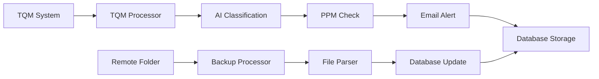

# Automatic PPM Criterion Highlight System


## 專案簡介

本專案全名為 K9 automatic ppm criterion highlight system V2.0.0。此系統是一個自動化的 PPM（Parts Per Million）標準突出顯示系統，專為機鑽品質監控而設計。系統整合了 AI 圖像分類、品質資料分析、自動警報通知、**機鑽圖檔自動備份**等功能，能夠即時監控機鑽過程的品質狀況並自動發送警告。

## 修正紀錄
- **V2.0.1 (2025-12-30)**:
  - 重構系統架構，提升效能和穩定性
  - 使用 FastAPI 和 Asyncio 實現非同步處理
  - 引入 ThreadPoolExecutor 處理阻塞任務
  - 改善資料庫操作，使用 SQLAlchemy ORM 以及 asynccontextmanager 管理資料庫連線
  - 增加 Redis 快取系統提升 API 回應速度
  - 優化日誌系統，集中管理日誌檔案
  - 更新 API 文件，提供更完整的端點說明
  - 改善錯誤處理和例外管理
  - **新增機鑽圖檔自動備份功能 (Backup Service)**
    - 自動從遠端共享資料夾下載機鑽圖檔
    - 智能檔案名稱解析與資料庫比對
    - 支援 Target/Panel 圖檔類型識別
    - 自動更新資料庫圖檔路徑資訊
    - 失敗項目待處理清單管理
    - 錯誤通知郵件機制

## 系統流程圖

詳細的系統流程圖請參考 [mermaid.md](mermaid.md) 檔案。

### 快速預覽



## 主要功能

### 核心功能
- **即時品質監控**：自動監控機鑽過程的 PPM 指標
- **AI 圖像分類**：使用機器學習對機鑽圖像進行自動分類
- **自動警報系統**：當 PPM 超出管制界限時自動發送 Email 警告
- **品質資料分析**：提供失效率統計和趨勢分析
- **回饋記錄系統**：記錄工程師回饋和處理狀態
- **🆕 機鑽圖檔自動備份**：
  - 自動掃描遠端共享資料夾
  - 智能解析機鑽圖檔名稱
  - 自動下載並儲存到本地備份
  - 更新資料庫圖檔路徑資訊
  - 支援 Target/Panel 圖檔區分
  - 失敗項目追蹤與通知

### API 功能模組
- **機鑽資料管理** (`/api/drill/*`)
- **PPM 標準管理** (`/api/drill/criteria`, `/api/drill/arlimit`)
- **郵件通知管理** (`/api/drill/mail`)
- **回饋記錄管理** (`/api/drill/feedback`)
- **使用者操作記錄** (`/api/drill/modification`)

## 技術架構
- **套件管理**：使用 `uv` 進行相依套件管理
- **非同步架構**：採用 FastAPI 和 Asyncio 提升效能
- **執行緒池**：對於自動化任務使用 ThreadPoolExecutor 處理阻塞任務
- **微服務架構**：各功能模組獨立部署，互相通訊
- **資料庫**：MySQL 作為主要資料庫，MSSQL 作為 TQM 資料來源，Redis 作為快取系統
- **日誌系統**：集中管理日誌，便於監控和除錯
- **🆕 SMB 協定整合**：使用 pywin32 連線 Windows 網路共享資料夾


### 後端技術
- **uv**: 相依套件管理，快速佈署，並支援與控管多 Python 版本
- **uvicorn**: 高效能的 ASGI 伺服器
- **FastAPI**: 現代化的 Python Web 框架
- **SQLAlchemy**: ORM 資料庫操作，並引用非同步資料庫處理
- **Asyncio**: 非同步程式設計
- **Pydantic**: 資料驗證和序列化
- **httpx**: 非同步 HTTP 客戶端
- **loguru**: 日誌管理
- **🆕 pywin32**: Windows API 整合 (SMB 連線)
- **🆕 dataclasses**: 資料類別定義

### 資料庫
- **MySQL**: 主要資料存儲（品質資料、設定等）
- **MSSQL**: TQM 系統資料來源
- **Redis**: 快取系統

### 外部服務整合
- **AI 服務中心**: 機鑽圖像分類
- **SOAP API**: 規格值查詢
- **SMTP 服務**: Email 通知
- **🆕 Windows 網路共享**: 遠端機鑽圖檔存取 (SMB 協定)

## 安裝與設定
- **使用uv啟動**: 若使用 `uv` 進行相依套件管理，請依照以下方式進行
    1. 使用uv建立虛擬環境並指定python版本
        ```bash
        uv venv --python=python3_版本(這裡使用3.10.13)
        ```
    2. 使用 `uv` 安裝相依套件
        ```bash
        uv pip install -r requirements.txt
        ```
    3. 透過uv啟動應用程式
        ```bash
        uv run .\main.py
        若不透過main.py執行則可以直接執行以下指令
        uv uvicorn app.app:app --host 0.0.0.0 --port 8009
        ```
    4. 透過uv進行快速佈署
        ```bash
        uv deploy
        ```
- **透過Docker-Compose啟動**: 若使用 Docker-Compose 進行部署，請依照以下方式進行
    1. 建立 `.env` 檔案並設定docker需求相關環境變數
    2. 使用以下指令啟動服務
        ```bash
        docker-compose up -d
        ```

### 環境需求
- Python 3.10.13+
- pip 23.0+
- sqlalchemy 1.4+
- FastAPI 0.95+
- pytest 7.0+
- MySQL 資料庫
- Redis 快取服務
- MSSQL Server（TQM 資料來源）
- **🆕 Windows Server (SMB 網路共享支援)**
- **🆕 pywin32 (Windows API 支援)**

### 環境變數設定

建立 `.env` 檔案並設定以下變數：

```env
# MySQL 資料庫設定
MYSQL_USER=your_mysql_user
MYSQL_PASSWORD=your_mysql_password
MYSQL_HOST=localhost
MYSQL_PORT=3306
MYSQL_DB=tid_5940

# MSSQL 資料庫設定
MSSQL_USER=your_mssql_user
MSSQL_PASSWORD=your_mssql_password
MSSQL_HOST=your_mssql_host
MSSQL_PORT=1433
MSSQL_DB=mvTQMBox

# Redis 設定
REDIS_HOST=localhost
REDIS_PORT=6379
REDIS_PASSWORD=your_redis_password

# Email 服務設定
EMAIL_HOST=your_smtp_host
EMAIL_PORT=25

# 檔案路徑設定
PPM_FILE_NAME=ppm_criteria_limit.xlsx

# 🆕 備份服務設定
BACKUP_REMOTE_PATH=\\\\server\\shared\\drill_images
BACKUP_DEST_PATH=D:\\drill_map_backup
BACKUP_AD_ACCOUNT=your_domain_account
BACKUP_AD_PASSWORD=your_domain_password
BACKUP_AD_DOMAIN=your_domain

# AI 服務設定
AI_SERVICE_HOST=localhost
AI_SERVICE_PORT=8009

# SOAP API 設定
SOAP_URL=http://your-soap-server/serviceproxy.asmx
```

## 執行方式

### 開發環境

```bash
# 直接執行 main.py
python main.py

# 或使用 uvicorn
uvicorn app.app:app --host 0.0.0.0 --port 8009 --reload
```

### 生產環境

```bash
uvicorn app.app:app --host 0.0.0.0 --port 8009 --workers 4
```

## API 文件

啟動服務後，可透過以下網址查看 API 文件：
- Swagger UI: http://localhost:8009/docs
- ReDoc: http://localhost:8009/redoc

### 主要 API 端點

#### 機鑽資料相關
- `GET /api/drill/judge` - 取得機鑽判定結果
- `PUT /api/drill/report` - 更新機鑽報告資訊
- `GET /api/drill/failrate` - 取得失效率統計

#### PPM 標準管理
- `GET /api/drill/criteria` - 取得 PPM 標準限制資訊
- `POST /api/drill/criteria` - 新增 PPM 標準限制
- `GET /api/drill/arlimit` - 取得 AR 等級限制

#### 通知管理
- `GET /api/drill/mail` - 取得郵件清單
- `POST /api/drill/mail` - 新增郵件接收者

## 專案結構

```
.
├── app/
│   ├── __init__.py
│   ├── app.py              # FastAPI 應用程式主檔案
│   ├── config.py           # 組態設定
│   ├── crud/               # 資料庫 CRUD 操作
│   ├── database/           # 資料庫連線設定
│   ├── models/             # 資料模型定義
│   ├── routes/             # API 路由定義
│   ├── schemas/            # Pydantic 資料驗證模型
│   ├── services/           # 外部服務整合
│   │   ├── tqm_service.py      # TQM 資料處理服務
│   │   ├── 🆕 backup_service.py # 機鑽圖檔備份服務
│   │   └── email_service.py    # 郵件通知服務
│   ├── tests/              # 🆕 單元測試
│   │   ├── services/
│   │   │   └── test_backup_service.py
│   │   └── models/
│   └── utils/              # 工具函式
├── log/                    # 日誌檔案
├── main.py                 # 程式進入點
├── requirements.txt        # Python 相依套件
├── pyproject.toml          # 專案設定
├── 🆕 test_report.html     # 測試報告 (HTML)
├── 🆕 TEST_REPORT.md       # 測試報告 (Markdown)
├── 🆕 analyze_coverage.py  # 測試覆蓋率分析工具
└── README.md               # 專案說明文件
```

## 核心服務說明

### TQM 處理器 (TQMProcessor)
- 定期從 MSSQL TQM 系統擷取最新資料
- 執行 AI 圖像分類預測
- 判斷 PPM 是否超出管制界限
- 自動發送警告 Email

### 🆕 備份處理器 (BackupProcessor)
- **遠端資料夾連線管理**：
  - 使用 Windows SMB 協定連線遠端共享資料夾
  - 支援 AD 網域驗證
  - 自動重試機制 (預設 3 次)
  - 連線失敗自動通知

- **檔案處理功能**：
  - 智能解析機鑽圖檔名稱
  - 提取批號、機台、軸別、時間等資訊
  - 識別 Target/Panel 圖檔類型
  - 自動跳過非 Target 圖檔

- **資料庫整合**：
  - 查詢對應的 DrillInfo 記錄
  - 更新 image_path 和 image_update_time 欄位
  - 刪除無對應記錄的備份檔案

- **錯誤處理**：
  - 更新失敗項目加入待處理清單
  - 定期發送待處理項目通知郵件
  - 完整的日誌記錄

### 資料轉換器 (DataTransfer)
- 處理不同資料來源的格式轉換
- 計算失效率統計
- 產生 Email 內容

### 快取系統
- 使用 Redis 提升 API 回應速度
- 自動管理快取過期時間

## 監控與日誌

### 日誌系統
- 日誌檔案位置：`./log/log_YYYY-MM-DD.log`
- 包含系統運行狀態、錯誤資訊、API 存取記錄
- **🆕 備份處理日誌**：
  - 連線狀態記錄
  - 檔案處理進度
  - 更新成功/失敗統計
  - 待處理清單追蹤

### 定時任務
- **TQM 資料處理**: 每 10 分鐘執行一次
- **🆕 備份處理**: 每 1 小時執行一次 (可調整為整點執行)
- 自動監控新的機鑽資料

### 🆕 測試與品質保證
- **單元測試覆蓋率**: 95%+ (Backup Service)
- **測試報告**: 自動生成 HTML 和 Markdown 格式
- **測試工具**: pytest + pytest-asyncio
- **Mock 策略**: 完整隔離外部依賴

詳細測試報告請參考：
- [TEST_REPORT.md](TEST_REPORT.md) - Markdown 格式測試報告
- [test_report.html](test_report.html) - 互動式 HTML 測試報告

## 測試指令

### 執行所有測試
```bash
pytest app/tests/ -v
```

### 執行特定服務測試
```bash
# Backup Service 測試
pytest app/tests/services/test_backup_service.py -v

# TQM Service 測試
pytest app/tests/services/test_tqm_service.py -v

# Drill CRUD 測試
pytest app/tests/crud/test_drill.py -v

# Feedback CRUD 測試
pytest app/tests/crud/test_feedback.py -v

# User CRUD 測試
pytest app/tests/crud/test_user.py -v

# Config 測試
pytest app/tests/test_config.py -v

# 生成 HTML 測試報告
pytest app/tests/services/test_backup_service.py --html=test_report.html --self-contained-html
```

### 生成 HTML 測試報告
```bash
pytest app/tests/ -v --html=test_report_full.html --self-contained-html
```

### 測試覆蓋率分析
```bash
pytest app/tests/ -v --cov=app --cov-report=html
```

## 貢獻指南

1. Fork 此專案
2. 建立功能分支 (`git checkout -b feature/AmazingFeature`)
3. 提交變更 (`git commit -m 'Add some AmazingFeature'`)
4. 推送到分支 (`git push origin feature/AmazingFeature`)
5. 建立 Pull Request

### 開發規範
- **程式碼品質**: 遵循 PEP 8 規範
- **測試要求**: 新功能需附帶單元測試，覆蓋率 > 90%
- **文件更新**: 更新相關 API 文件和流程圖
- **日誌記錄**: 關鍵操作需記錄日誌

## 授權

本專案使用內部授權，請聯繫專案維護人員了解使用條款。

## 聯繫資訊

如有問題或建議，請聯繫系統維護團隊。

---

## 📊 系統效能指標

### TQM 處理器
- 批次處理大小: 500 筆
- 資料庫工作執行緒: 5
- 平均處理時間: < 5 分鐘

### 🆕 備份處理器
- 每小時處理檔案數: ~100-500 檔案
- 平均檔案大小: 2-5 MB
- 連線重試次數: 3 次
- 平均處理時間: 5-15 分鐘

### API 回應時間
- 快取命中: < 50ms
- 資料庫查詢: 100-300ms
- 複雜查詢: < 1s

---

**最後更新**: 2026-02-08  
**版本**: V2.0.1 
**維護團隊**: TID 5940 開發團隊