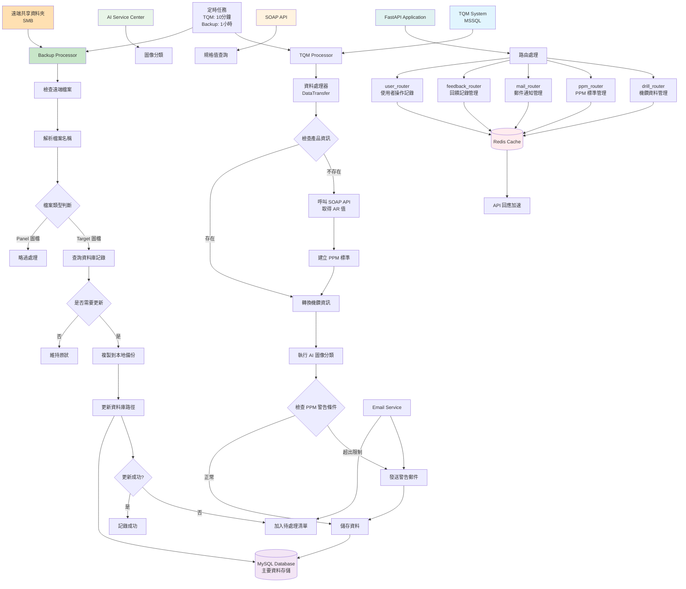
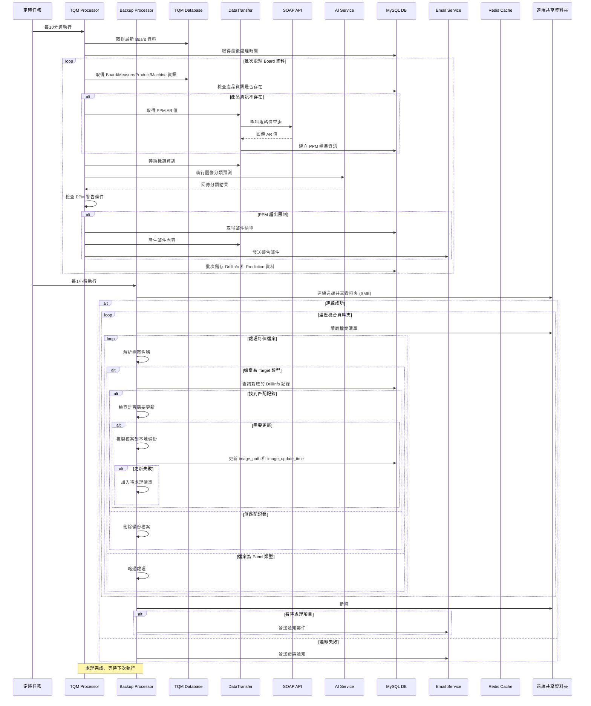
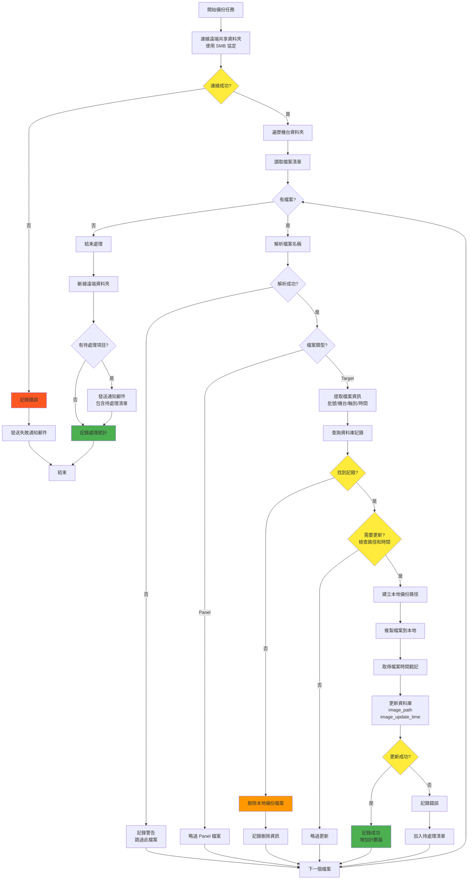
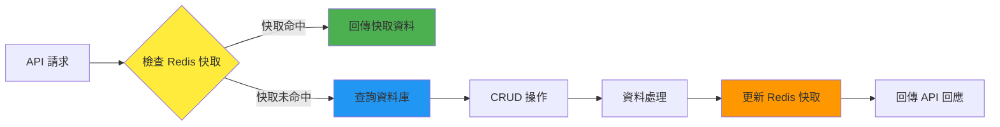
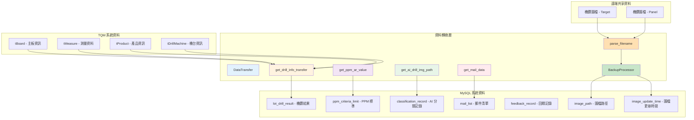
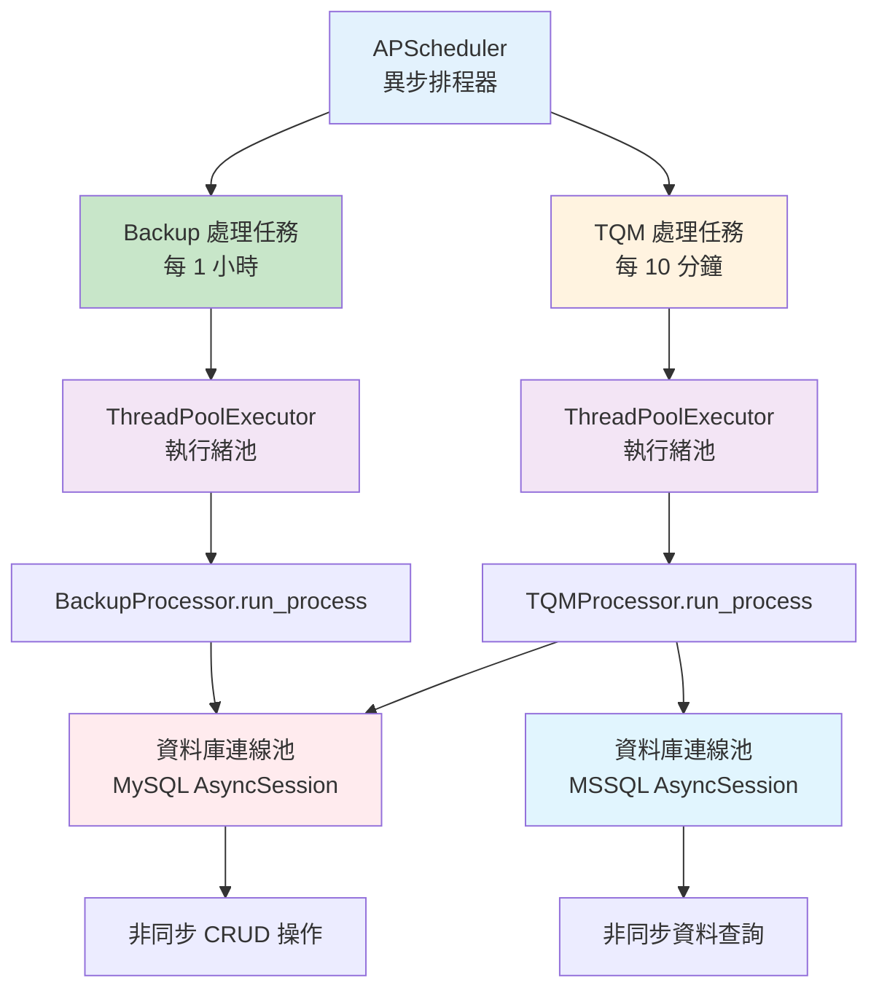

# PPM 系統流程圖

## 系統整體架構流程圖

```mermaid
graph TB
    %% 外部系統
    A[TQM System<br/>MSSQL] --> B[TQM Processor]
    C[AI Service Center] --> D[圖像分類]
    E[SOAP API] --> F[規格值查詢]
    G[遠端共享資料夾<br/>SMB] --> H[Backup Processor]
    
    %% 主要處理流程
    B --> I[資料處理器<br/>DataTransfer]
    I --> J{檢查產品資訊}
    J -->|不存在| K[呼叫 SOAP API<br/>取得 AR 值]
    K --> L[建立 PPM 標準]
    J -->|存在| M[轉換機鑽資訊]
    L --> M
    
    M --> N[執行 AI 圖像分類]
    N --> O{檢查 PPM 警告條件}
    O -->|超出限制| P[發送警告郵件]
    O -->|正常| Q[儲存資料]
    P --> Q
    
    %% 備份處理流程
    H --> R[檢查遠端檔案]
    R --> S[解析檔案名稱]
    S --> T{檔案類型判斷}
    T -->|Target 圖檔| U[查詢資料庫記錄]
    T -->|Panel 圖檔| V[略過處理]
    U --> W{是否需要更新}
    W -->|是| X[複製到本地備份]
    W -->|否| Y[維持原狀]
    X --> Z[更新資料庫路徑]
    Z --> AA{更新成功?}
    AA -->|否| AB[加入待處理清單]
    AA -->|是| AC[記錄成功]
    
    %% 資料庫層
    Q --> AD[(MySQL Database<br/>主要資料存儲)]
    Z --> AD
    
    %% API 層
    AE[FastAPI Application] --> AF[路由處理]
    AF --> AG[drill_router<br/>機鑽資料管理]
    AF --> AH[ppm_router<br/>PPM 標準管理]
    AF --> AI[mail_router<br/>郵件通知管理]
    AF --> AJ[feedback_router<br/>回饋記錄管理]
    AF --> AK[user_router<br/>使用者操作記錄]
    
    %% 快取系統
    AL[(Redis Cache)] --> AM[API 回應加速]
    AG --> AL
    AH --> AL
    AI --> AL
    AJ --> AL
    AK --> AL
    
    %% 定時任務
    AN[定時任務<br/>TQM: 10分鐘<br/>Backup: 1小時] --> B
    AN --> H
    
    %% 外部服務
    AO[Email Service] --> P
    AO --> AB
    
    style A fill:#e1f5fe
    style C fill:#e8f5e8
    style E fill:#fff3e0
    style G fill:#ffe0b2
    style AD fill:#f3e5f5
    style AL fill:#ffebee
    style AE fill:#e0f2f1
    style H fill:#c8e6c9
```

## 核心業務流程圖

```mermaid
sequenceDiagram
    participant Timer as 定時任務
    participant TQM as TQM Processor
    participant Backup as Backup Processor
    participant MSSQL as TQM Database
    participant Transfer as DataTransfer
    participant SOAP as SOAP API
    participant AI as AI Service
    participant MySQL as MySQL DB
    participant Email as Email Service
    participant Redis as Redis Cache
    participant Remote as 遠端共享資料夾
    
    %% TQM 處理流程
    Timer->>TQM: 每10分鐘執行
    TQM->>MSSQL: 取得最新 Board 資料
    TQM->>MySQL: 取得最後處理時間
    
    loop 批次處理 Board 資料
        TQM->>MSSQL: 取得 Board/Measure/Product/Machine 資訊
        TQM->>MySQL: 檢查產品資訊是否存在
        
        alt 產品資訊不存在
            TQM->>Transfer: 取得 PPM AR 值
            Transfer->>SOAP: 呼叫規格值查詢
            SOAP-->>Transfer: 回傳 AR 值
            Transfer->>MySQL: 建立 PPM 標準資訊
        end
        
        TQM->>Transfer: 轉換機鑽資訊
        TQM->>AI: 執行圖像分類預測
        AI-->>TQM: 回傳分類結果
        
        TQM->>TQM: 檢查 PPM 警告條件
        
        alt PPM 超出限制
            TQM->>MySQL: 取得郵件清單
            TQM->>Transfer: 產生郵件內容
            TQM->>Email: 發送警告郵件
        end
        
        TQM->>MySQL: 批次儲存 DrillInfo 和 Prediction 資料
    end
    
    %% Backup 處理流程
    Timer->>Backup: 每1小時執行
    Backup->>Remote: 連線遠端共享資料夾 (SMB)
    
    alt 連線成功
        loop 遍歷機台資料夾
            Backup->>Remote: 讀取檔案清單
            
            loop 處理每個檔案
                Backup->>Backup: 解析檔案名稱
                
                alt 檔案為 Target 類型
                    Backup->>MySQL: 查詢對應的 DrillInfo 記錄
                    
                    alt 找到匹配記錄
                        Backup->>Backup: 檢查是否需要更新
                        
                        alt 需要更新
                            Backup->>Backup: 複製檔案到本地備份
                            Backup->>MySQL: 更新 image_path 和 image_update_time
                            
                            alt 更新失敗
                                Backup->>Backup: 加入待處理清單
                            end
                        end
                    else 無匹配記錄
                        Backup->>Backup: 刪除備份檔案
                    end
                else 檔案為 Panel 類型
                    Backup->>Backup: 略過處理
                end
            end
        end
        
        Backup->>Remote: 斷線
        
        alt 有待處理項目
            Backup->>Email: 發送通知郵件
        end
    else 連線失敗
        Backup->>Email: 發送錯誤通知
    end
    
    Note over TQM,Backup: 處理完成，等待下次執行
```

## 機鑽圖檔備份流程圖

```mermaid
graph TB
    A[開始備份任務] --> B[連線遠端共享資料夾<br/>使用 SMB 協定]
    B --> C{連線成功?}
    C -->|否| D[記錄錯誤]
    D --> E[發送失敗通知郵件]
    E --> F[結束]
    
    C -->|是| G[遍歷機台資料夾]
    G --> H[讀取檔案清單]
    H --> I{有檔案?}
    I -->|否| J[結束處理]
    
    I -->|是| K[解析檔案名稱]
    K --> L{解析成功?}
    L -->|否| M[記錄警告<br/>跳過此檔案]
    M --> N[下一個檔案]
    
    L -->|是| O{檔案類型?}
    O -->|Panel| P[略過 Panel 檔案]
    P --> N
    
    O -->|Target| Q[提取檔案資訊<br/>批號/機台/軸別/時間]
    Q --> R[查詢資料庫記錄]
    R --> S{找到記錄?}
    
    S -->|否| T[刪除本地備份檔案]
    T --> U[記錄刪除資訊]
    U --> N
    
    S -->|是| V{需要更新?<br/>檢查路徑和時間}
    V -->|否| W[略過更新]
    W --> N
    
    V -->|是| X[建立本地備份路徑]
    X --> Y[複製檔案到本地]
    Y --> Z[取得檔案時間戳記]
    Z --> AA[更新資料庫<br/>image_path<br/>image_update_time]
    
    AA --> AB{更新成功?}
    AB -->|是| AC[記錄成功<br/>增加計數器]
    AC --> N
    
    AB -->|否| AD[記錄錯誤]
    AD --> AE[加入待處理清單]
    AE --> N
    
    N --> I
    J --> AF[斷線遠端資料夾]
    AF --> AG{有待處理項目?}
    AG -->|是| AH[發送通知郵件<br/>包含待處理清單]
    AG -->|否| AI[記錄處理統計]
    AH --> AI
    AI --> F
    
    style C fill:#ffeb3b
    style S fill:#ffeb3b
    style V fill:#ffeb3b
    style AB fill:#ffeb3b
    style D fill:#ff5722
    style T fill:#ff9800
    style AC fill:#4caf50
    style AI fill:#4caf50
```

## API 處理流程圖

```mermaid
graph LR
    A[API 請求] --> B{檢查 Redis 快取}
    B -->|快取命中| C[回傳快取資料]
    B -->|快取未命中| D[查詢資料庫]
    D --> E[CRUD 操作]
    E --> F[資料處理]
    F --> G[更新 Redis 快取]
    G --> H[回傳 API 回應]
    
    style B fill:#ffeb3b
    style C fill:#4caf50
    style D fill:#2196f3
    style G fill:#ff9800
```

## 資料流轉換流程圖

```mermaid
graph TB
    subgraph "TQM 系統資料"
        A1[tBoard - 主板資訊]
        A2[tMeasure - 測量資料]
        A3[tProduct - 產品資訊]
        A4[tDrillMachine - 機台資訊]
    end
    
    subgraph "遠端共享資料"
        A5[機鑽圖檔 - Target]
        A6[機鑽圖檔 - Panel]
    end
    
    subgraph "資料轉換層"
        B[DataTransfer]
        B1[get_drill_info_transfer]
        B2[get_ppm_ar_value]
        B3[get_ai_drill_img_path]
        B4[get_mail_data]
        B5[BackupProcessor]
        B6[parse_filename]
    end
    
    subgraph "MySQL 系統資料"
        C1[lot_drill_result - 機鑽結果]
        C2[ppm_criteria_limit - PPM 標準]
        C3[classification_record - AI 分類記錄]
        C4[mail_list - 郵件清單]
        C5[feedback_record - 回饋記錄]
        C6[image_path - 圖檔路徑]
        C7[image_update_time - 圖檔更新時間]
    end
    
    A1 --> B1
    A2 --> B1
    A3 --> B1
    A4 --> B1
    
    A5 --> B6
    A6 --> B6
    
    B1 --> C1
    B2 --> C2
    B3 --> C3
    B4 --> C4
    B5 --> C6
    B5 --> C7
    B6 --> B5
    
    style B fill:#e3f2fd
    style B1 fill:#fff3e0
    style B2 fill:#f3e5f5
    style B3 fill:#e8f5e8
    style B4 fill:#ffebee
    style B5 fill:#c8e6c9
    style B6 fill:#ffe0b2
```

## 郵件警告處理流程圖

```mermaid
graph TB
    subgraph "PPM 警告郵件"
        A[檢查 PPM 值] --> B{PPM > 管制界限?}
        B -->|是| C[建立警告資訊]
        B -->|否| D[正常處理]
        
        C --> E[取得郵件清單]
        E --> F[分類收件者<br/>To/CC/BCC]
        F --> G[產生郵件內容]
        G --> H[包含機台資訊<br/>軸別、批號、PPM值]
        H --> I[建立網頁連結]
        I --> J[發送 SMTP 郵件]
        J --> K[記錄發送結果]
    end
    
    subgraph "備份失敗通知郵件"
        L[備份處理完成] --> M{有待處理項目?}
        M -->|是| N[彙整待處理清單]
        M -->|否| O[無需通知]
        
        N --> P[建立通知內容<br/>批號/機台/軸別/時間]
        P --> Q[取得郵件清單]
        Q --> R[發送通知郵件]
        R --> S[記錄通知結果]
    end
    
    subgraph "連線失敗通知郵件"
        T[遠端連線失敗] --> U[記錄錯誤資訊]
        U --> V[建立錯誤通知]
        V --> W[發送錯誤郵件]
        W --> X[記錄錯誤結果]
    end
    
    style B fill:#ffeb3b
    style C fill:#ff5722
    style J fill:#4caf50
    style M fill:#ffeb3b
    style N fill:#ff9800
    style R fill:#4caf50
    style T fill:#f44336
    style W fill:#ff5722
```

## 系統定時任務架構圖

```mermaid
graph TB
    A[APScheduler<br/>異步排程器] --> B[TQM 處理任務<br/>每 10 分鐘]
    A --> C[Backup 處理任務<br/>每 1 小時]
    
    B --> D[ThreadPoolExecutor<br/>執行緒池]
    C --> E[ThreadPoolExecutor<br/>執行緒池]
    
    D --> F[TQMProcessor.run_process]
    E --> G[BackupProcessor.run_process]
    
    F --> H[資料庫連線池<br/>MySQL AsyncSession]
    F --> I[資料庫連線池<br/>MSSQL AsyncSession]
    
    G --> H
    
    H --> J[非同步 CRUD 操作]
    I --> K[非同步資料查詢]
    
    style A fill:#e3f2fd
    style B fill:#fff3e0
    style C fill:#c8e6c9
    style D fill:#f3e5f5
    style E fill:#f3e5f5
    style H fill:#ffebee
    style I fill:#e1f5fe
```