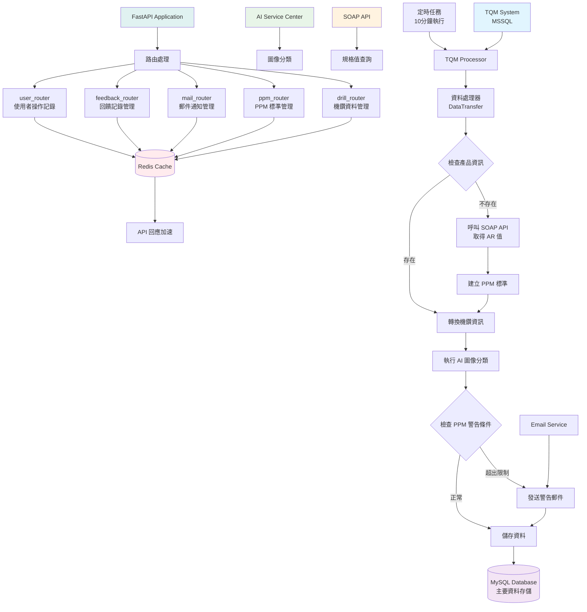
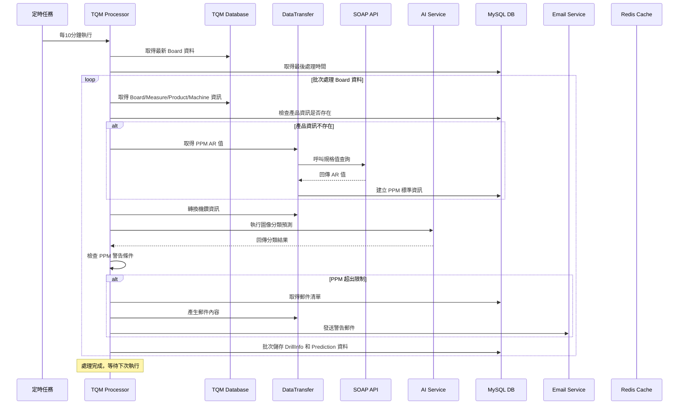
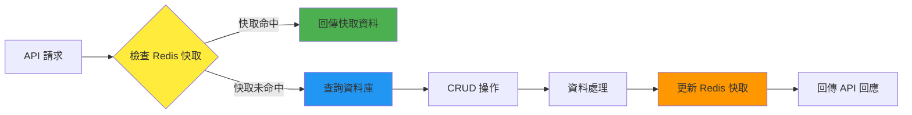
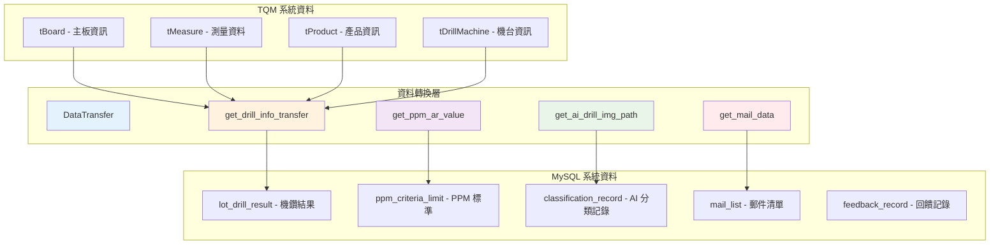
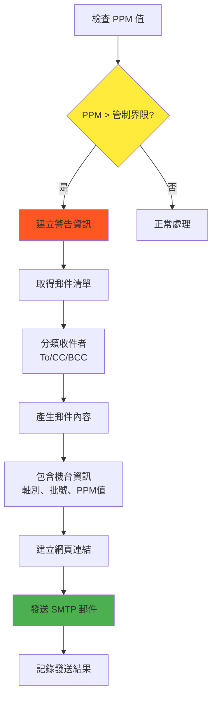

# PPM 系統流程圖

## 系統整體架構流程圖

```mermaid
graph TB
    %% 外部系統
    A[TQM System<br/>MSSQL] --> B[TQM Processor]
    C[AI Service Center] --> D[圖像分類]
    E[SOAP API] --> F[規格值查詢]
    
    %% 主要處理流程
    B --> G[資料處理器<br/>DataTransfer]
    G --> H{檢查產品資訊}
    H -->|不存在| I[呼叫 SOAP API<br/>取得 AR 值]
    I --> J[建立 PPM 標準]
    H -->|存在| K[轉換機鑽資訊]
    J --> K
    
    K --> L[執行 AI 圖像分類]
    L --> M{檢查 PPM 警告條件}
    M -->|超出限制| N[發送警告郵件]
    M -->|正常| O[儲存資料]
    N --> O
    
    %% 資料庫層
    O --> P[(MySQL Database<br/>主要資料存儲)]
    
    %% API 層
    Q[FastAPI Application] --> R[路由處理]
    R --> S[drill_router<br/>機鑽資料管理]
    R --> T[ppm_router<br/>PPM 標準管理]
    R --> U[mail_router<br/>郵件通知管理]
    R --> V[feedback_router<br/>回饋記錄管理]
    R --> W[user_router<br/>使用者操作記錄]
    
    %% 快取系統
    X[(Redis Cache)] --> Y[API 回應加速]
    S --> X
    T --> X
    U --> X
    V --> X
    W --> X
    
    %% 定時任務
    Z[定時任務<br/>10分鐘執行] --> B
    
    %% 外部服務
    AA[Email Service] --> N
    
    style A fill:#e1f5fe
    style C fill:#e8f5e8
    style E fill:#fff3e0
    style P fill:#f3e5f5
    style X fill:#ffebee
    style Q fill:#e0f2f1
```

## 核心業務流程圖

```mermaid
sequenceDiagram
    participant Timer as 定時任務
    participant TQM as TQM Processor
    participant MSSQL as TQM Database
    participant Transfer as DataTransfer
    participant SOAP as SOAP API
    participant AI as AI Service
    participant MySQL as MySQL DB
    participant Email as Email Service
    participant Redis as Redis Cache
    
    Timer->>TQM: 每10分鐘執行
    TQM->>MSSQL: 取得最新 Board 資料
    TQM->>MySQL: 取得最後處理時間
    
    loop 批次處理 Board 資料
        TQM->>MSSQL: 取得 Board/Measure/Product/Machine 資訊
        TQM->>MySQL: 檢查產品資訊是否存在
        
        alt 產品資訊不存在
            TQM->>Transfer: 取得 PPM AR 值
            Transfer->>SOAP: 呼叫規格值查詢
            SOAP-->>Transfer: 回傳 AR 值
            Transfer->>MySQL: 建立 PPM 標準資訊
        end
        
        TQM->>Transfer: 轉換機鑽資訊
        TQM->>AI: 執行圖像分類預測
        AI-->>TQM: 回傳分類結果
        
        TQM->>TQM: 檢查 PPM 警告條件
        
        alt PPM 超出限制
            TQM->>MySQL: 取得郵件清單
            TQM->>Transfer: 產生郵件內容
            TQM->>Email: 發送警告郵件
        end
        
        TQM->>MySQL: 批次儲存 DrillInfo 和 Prediction 資料
    end
    
    Note over TQM: 處理完成，等待下次執行
```

## API 處理流程圖

```mermaid
graph LR
    A[API 請求] --> B{檢查 Redis 快取}
    B -->|快取命中| C[回傳快取資料]
    B -->|快取未命中| D[查詢資料庫]
    D --> E[CRUD 操作]
    E --> F[資料處理]
    F --> G[更新 Redis 快取]
    G --> H[回傳 API 回應]
    
    style B fill:#ffeb3b
    style C fill:#4caf50
    style D fill:#2196f3
    style G fill:#ff9800
```

## 資料流轉換流程圖

```mermaid
graph TB
    subgraph "TQM 系統資料"
        A1[tBoard - 主板資訊]
        A2[tMeasure - 測量資料]
        A3[tProduct - 產品資訊]
        A4[tDrillMachine - 機台資訊]
    end
    
    subgraph "資料轉換層"
        B[DataTransfer]
        B1[get_drill_info_transfer]
        B2[get_ppm_ar_value]
        B3[get_ai_drill_img_path]
        B4[get_mail_data]
    end
    
    subgraph "MySQL 系統資料"
        C1[lot_drill_result - 機鑽結果]
        C2[ppm_criteria_limit - PPM 標準]
        C3[classification_record - AI 分類記錄]
        C4[mail_list - 郵件清單]
        C5[feedback_record - 回饋記錄]
    end
    
    A1 --> B1
    A2 --> B1
    A3 --> B1
    A4 --> B1
    
    B1 --> C1
    B2 --> C2
    B3 --> C3
    B4 --> C4
    
    style B fill:#e3f2fd
    style B1 fill:#fff3e0
    style B2 fill:#f3e5f5
    style B3 fill:#e8f5e8
    style B4 fill:#ffebee
```

## 郵件警告處理流程圖

```mermaid
graph TB
    A[檢查 PPM 值] --> B{PPM > 管制界限?}
    B -->|是| C[建立警告資訊]
    B -->|否| D[正常處理]
    
    C --> E[取得郵件清單]
    E --> F[分類收件者<br/>To/CC/BCC]
    F --> G[產生郵件內容]
    G --> H[包含機台資訊<br/>軸別、批號、PPM值]
    H --> I[建立網頁連結]
    I --> J[發送 SMTP 郵件]
    J --> K[記錄發送結果]
    
    style B fill:#ffeb3b
    style C fill:#ff5722
    style J fill:#4caf50
```